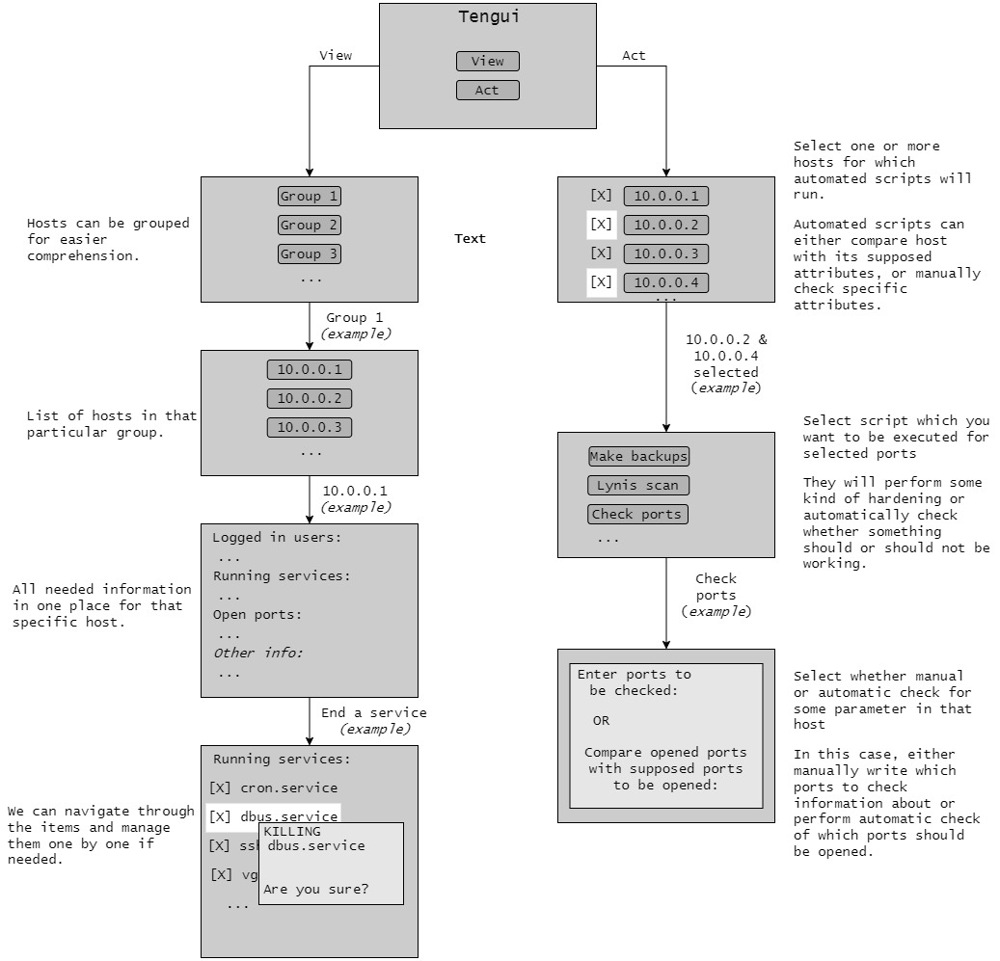

# Tengui

## Introduction

Name "Tengui" is composed of two expressions: *Tengu* + *UI* 

**Tengu** are mythical bird-like creatures in Japanese culture, protectors of nature and skilled warriors. Just like them, our application will watch over "green" systems and act viciously to protect them.

Tengui TUI (terminal user interface) is a work-in-progress tool for remote host observation and management made by Vilnius University faculty of Mathematics and Informatics Information Technologies students:

- Martin Martijan (LordSereos)
- Tomas Petruoka (tmsptr)
- Haroldas Klangauskas (HaroldasKL)

Under supervision of:

- dr. Linas Bukauskas
- lect. Virgilijus Krinickij

Aim of this tool is to quickly display necessary monitoring information about connected hosts machines (Linux only) and provide functionality to quickly mitigate possible threats, which can be deducted from the displayed information in the TUI.

## Files description
There are following directories and files in this project:

- **modules** - folder containing necessary scripts for updating and managing hosts.
- **hosts** - file which should be populated with IPv4 addresses of hosts for desired monitoring.
    - Write group name for the hosts below (for example -WEBSERVERS (don't forget the '-' denotion))
  	- Then write information about the host using spaces:
  	  **{IP} {port} {username}**
  	- Example could be:  \
        **-WEBSERVERS** \
        **10.0.0.1 22 admin** \
        **10.0.0.2 22 user** \
  	    \
  	    **-DATABASE** \
  	    **...**
  	    
- **tengui.py** - main script which initializes the terminal user interface.
- **functions.py** - file which contains the functions used in the main script.
- **boxes.py** - file which contains front-end terminal user interface elements.
- **doc_file** - file in which we write description for our hosts in a formatted matter. It involves writing which ports should be opened on that host, backup folder locations, surveilance of changed files in a folder locations, and more.

## Usage
```bash
python3 tengui.py
```
### Prerequisites:
- python3
- ssh keys exchange between monitoring machine and other hosts
- user must have root privileges on the remote host
- local_dir in modules/* scripts has to be changed to the local directory of the using machine. Now it is set to /home/sereos/Desktop/..., but all of these instances has to be changed for user which runs the TUI. (TO DO: have a separate file where we would need to change that only once, and then scripts would read the path from that file)
- terminal height should be not smaller than 22 lines.

## User interaction flow (OUTDATED)



## Current functionality

- Hosts can be grouped. At least one group must be created under which hosts will be listed.
- SINGLE HOST VIEW (ENTER is pressed when on a single host):
    - Display information about a single host:
        - Logged in users
        - Currently running services
        - Opened ports
        - Which ports should be opened
        - Unsucessful login attempts
        - Changed files in folders under surveilance
        - Send commands to the remote host.
      - Users and services can be killed from UI.
      - Context menu can be opened with 'h' for help when viewing a host.
- APPLY SCRIPTS MENU (ENTER is pressed when multiple hosts are selected with 't' or 'g'):
  - When host(s) are selected and ENTER pressed, a window to select which scripts to apply to them opens. The scripts include:
    - SETUP AUDIT: install and start built-in auditing tools on remote hosts to send information to the master machine. Apply on all hosts when first connected.
    - MAKE BACKUPS: backs up files from a remote host using SCP. Backed up directories are found in **./backups**.
    - CHECK PORTS: compare opened ports with documented ones in doc_file. TO-DO: add input field to be able to write additional ones. Results are stored in **./modules/ports/outputs**.
    - MANIFEST: creates MD5 hashes and runs diff with the previous hash ouput, per location. Diff output in **./modules/hasher**. This is run automatically for a host every time a single host is viewed.
    - CHECK ROOTKIT: runs rootkit/backdoor checks remotely. Saves output in **tengui/modules/chkrootkit**. Give few minutes for all scripts to execute and log to appear.
    - RUN LYNIS SCAN: returns logs to **tengui/modules/lynisCan**. (CURRENTLY REMOVED FROM FUNCTIONALITY)
      
  - Scripts are run simultaneously on multiple hosts, and some of them (like Lynis Scan) are run on the background.


